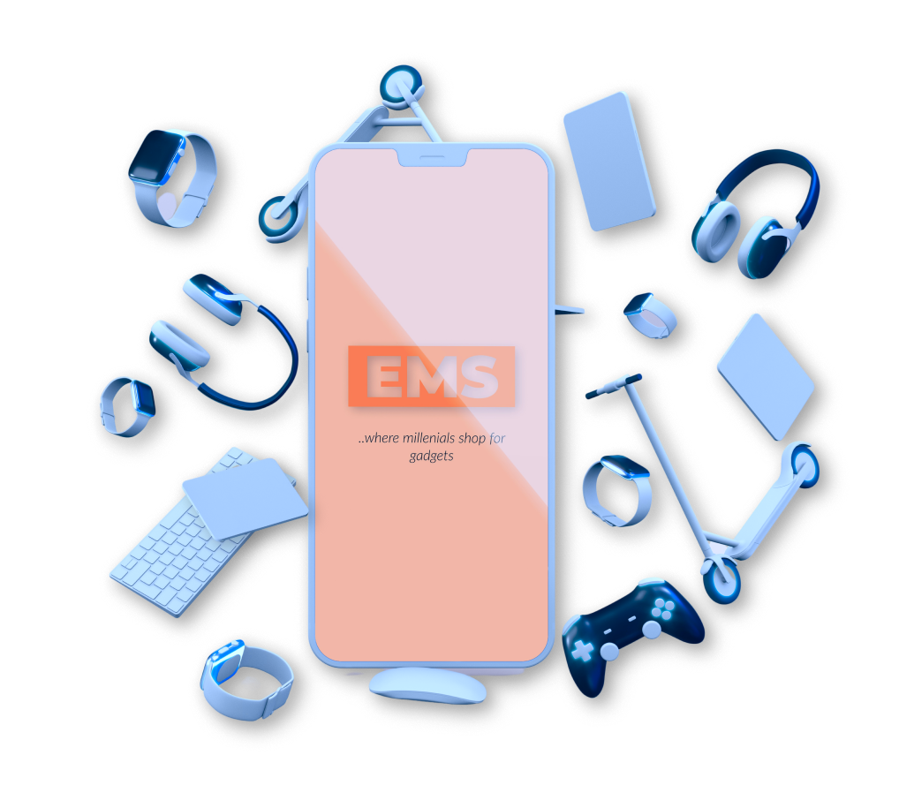

# ECOMMERCE-SITE
Development of an e-commerce site with a simple shopping cart integrated with Paystack checkout/payment. The EMS website is a fully responsive ecommerce website with maximum compatiblities in all mobile devices and built using HTML, CSS and JavaScript.

## LOGO

## Upon Completion.
Upon the full development of this website, all features that are expected (or required) to work include:

1. The landing page must contain all sections (The Intro Section, The About Section, The Shop Section, The Footer Section) and their appropriate content.

2. Products are listed in gallery/grid format

3. Users will be able to add any listed product to the cart;

4. Users are able to remove products from the cart either on the landing page or the shopping cart modal.

5. Users are also able to increase or decrease the quantity of any product in the cart and the prices change accordingly.

6. The User Details form always validate each input field before moving to the Paystack checkout.

7. The total amount is updated to reflect the sum of all product prices based on quantity.

8. The cart button also reflects the number of items (not quantity) in the cart

9. The Paystack checkout is fully functional (in Test Mode)

10. The Summary modal always shows after every successful payment with Paystack. It contains a dynamic message informing the user (stating the user’s name) of a successful purchase and it contains the order summary which is the list of items bought and their respective quantity.

11. After every successful purchase, the cart is cleared of all data.

12. The website is responsive.

## Installing EMS

To install EMS, follow these steps:

Linux and macOS:
sudo git clone https://github.com/OliviaTetteh/ecommerce-site.git

Windows:
git clone https://github.com/OliviaTetteh/ecommerce-site.git

Contact:
If you want to reach me [Visit my portfolio](https://github.com/OliviaTetteh).